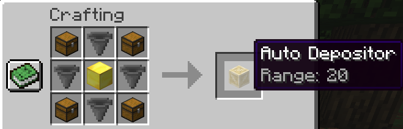

# Auto Deposit

This plugin helps speed up your minecraft organization by automatically depositing items into nearby chests that contain *similar* items.

Think of this plugin as a much easier and quicker sorting machine. Simply right-clicking the auto deposit block will send your items off to the nearby containers that they belong in. By default, there are three auto deposit blocks with ranges of 10, 20 and 30.

Crafting Recipes

Range: 10

Range: 20

Range: 30

Configurations

This plugin works without any required configuration changes. Should you want to customize your experience further, use the following:

| Configuration                | Default Value                                     | Description                                                                                                                                                        |
|------------------------------|---------------------------------------------------|--------------------------------------------------------------------------------------------------------------------------------------------------------------------|
| `auto_depositing_block_name` | `"Auto Depositor"`                                | The name of the block that does the auto depositing.                                                                                                               |
| `auto_depositing_block_lore` | `"Range: {RANGE}"`                                | The lore of the block that does the auto depositing. Lore appears when a player hovers over an item.                                                               |
| `auto_deposit_armor`         | `false`                                           | Whether or not your armor should be sent to nearby chests when you right-click an auto deposit block.                                                              |
| `auto_deposit_hotbar`        | `false`                                           | Whether or not your hotbar items should be sent to nearby chests when you right-click an auto deposit block.                                                       |
| `auto_depositing_blocks`     | See [here](./src/main/resources/auto_deposit.yml) | If you want to add more auto deposit blocks, change the texture, or change the crafting recipes, this is the configuration to do so.                               |
| `groupings`                  | See [here](./src/main/resources/auto_deposit.yml) | This config explains what items should be considered *similar*. For example, by default if a chest has iron boots, then an iron helmet will be sent to that chest. |

Commands

| Configuration            | Sample usage                                      | Description                                                      |
|--------------------------|---------------------------------------------------|------------------------------------------------------------------|
| `autodeposit`            | `/autodeposit 10`                                 | Trigger an auto deposit centered on yourself with a range of 10. |
| `adreload`               | `/adreload`                                       | Reload the configuration files.                                  |

